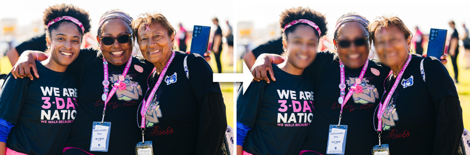
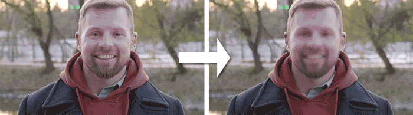

<h1 align="center">
Welcome to PixelateMe 👋<br />
Your python package to anonymize faces in images and videos
<p>
    <a href="LICENSE" target="_blank">
        
    </a>
</p>
</h1>

> With this CLI tool you can pixelate, blur or remove faces from videos and images. GPU acceleration supported.

<p align="center">
    
    
</p>

## ⚡️ Quickstart
### 📥 Install
```shell
pip install pixelateme
```

### ▶️ Run
After installation, pip registers a shortcut binary which can be called (on windows for example) like this:
```shell
pixelateme --mode blur FOLDER_OR_FILES
```
This will create a new ```pixelated``` folder, where all the pixelated files are stored.

## 🎯 Features
- Different anonymization modes: pixelate, blur and color
- GPU acceleration
- Preview of current processed files
- Face Recognition to only blur specific faces or to blur all faces except specific ones
- ONNXRT and OpenCV runtime backend

## 💻 CLI Arguments
* ```--suffix```: Filename suffix of processed files. Default: 
* ```--output``` (-o): Output directory for processed files. Default: ./pixelated
* ```--mode``` (-m): Mode of anonymization. Default: pixelate
* ```--threshold``` (-t): Threshold for detected faces (higher means more confidence). Default: 0.5
* ```--backend```: Desired backend (e.g. opencv or onnxrt). Auto prefers onnxrt and falls back to opencv. Default: auto
* ```--only-blur-this-faces```: Folder containing images of faces (one face per image), which should be considered for anonymization. All other faces won't be anonymized. Default: None
* ```--blur-except-this-faces```: Folder containing images of faces (one face per image), which should be ignored for anonymization. Default: None
* ```--ellipse```: Uses ellipses as form for anonymization. Default is rectangle
* ```--blur-strength```: Defines how "blurry" a face will be. Only working with ```--mode``` "blur". Default: 3
* ```--pixelate-size```: Size of pixelation effect. The higher the value, the harder it is to recognize the face. Default: 16
* ```--deepface-similarity```: Maximum similarity between two faces. Higher value means, that more faces are considered as equal. Only working in combination with ```--blur-except-this-faces``` or ```--only-blur-this-faces```. Default: 0.4
* ```--preview```: Enable preview of the currently processed image. No preview is default
* ```--face-recognition-size```: Image size to use for face recognition. Format: WxH (e.g. 720x480). Default: None
* ```--maximum-face-recognition-size```: Maximum number of pixels of the longest side for face recognition. Images larger than this will be downscaled for face recognition. This doesn't affect output resolution. Default: 640

## 👥 Author

👤 **Marius Butz**

* Website: http://marius-butz.de

## ⭐️ Show your support

- Give a [⭐️ star](https://github.com/mbpictures/tessera) if this project helped you!
- Create a [🍴 fork](https://github.com/mbpictures/tessera) and contribute by fixing bugs or adding features
